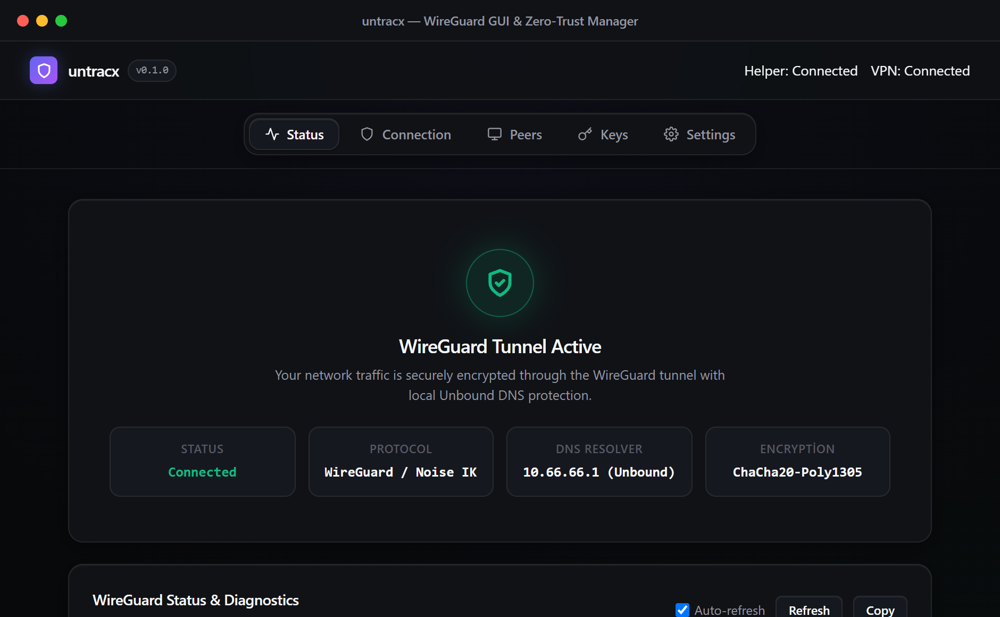
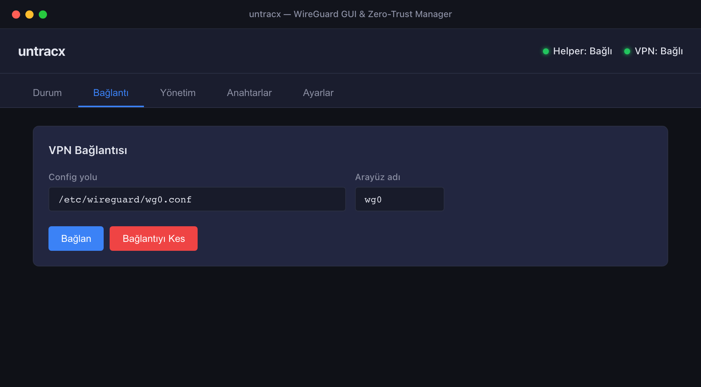
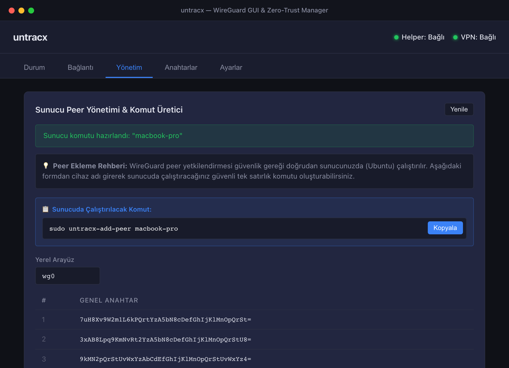
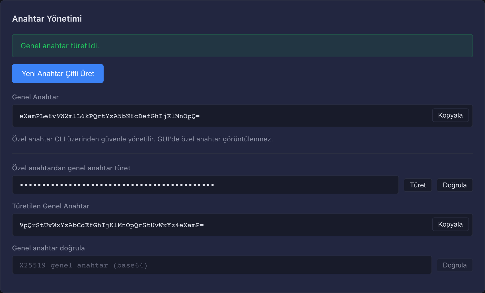
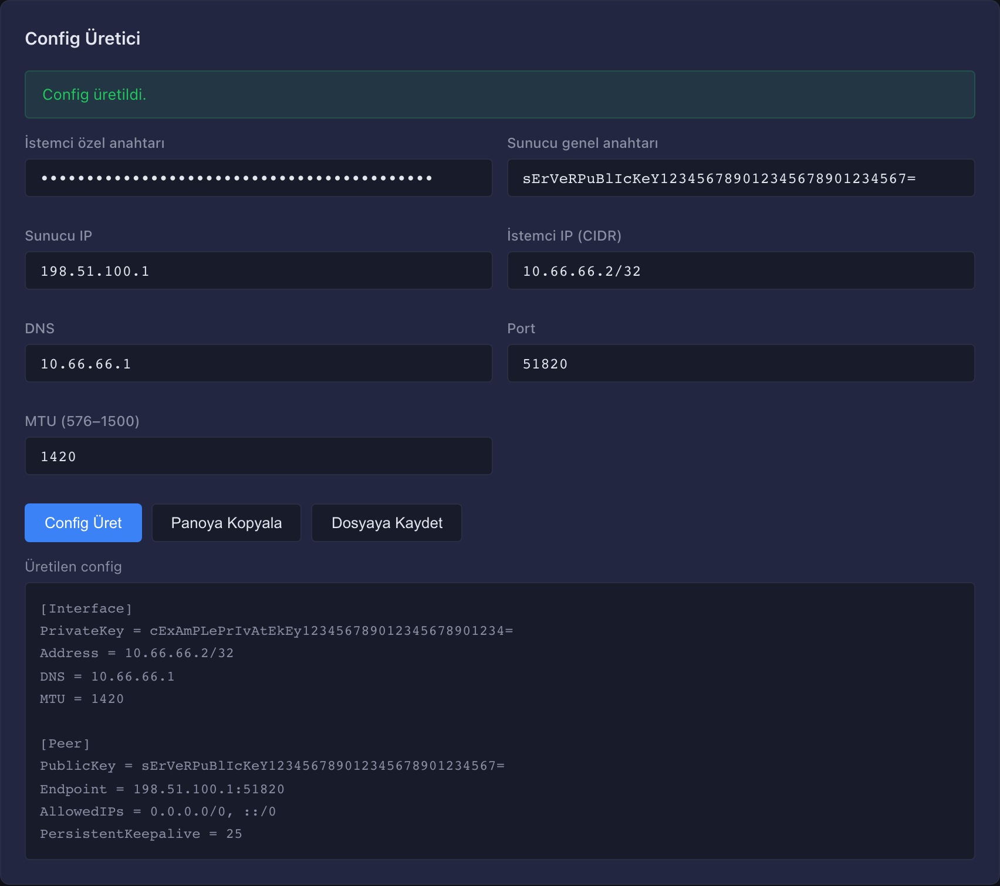
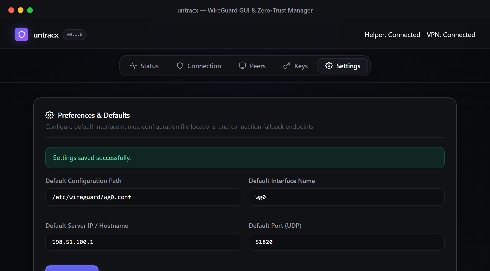

# untracx

**untracx** is a secure, verifiable, and sustainable personal WireGuard VPN solution. It focuses on foolproof automated server provisioning, zero-trust cryptographic key management, recursive DNS protection with Unbound, and seamless profile deployment to official WireGuard clients and the custom desktop GUI.

---

## 1. Supported Platform Matrix (v1)

| Layer | Platform / Environment | Status | Notes |
|---|---|---|---|
| **Server** | Ubuntu 22.04 / 24.04 LTS (x86_64 & arm64) | **Supported (Stable)** | Automated bootstrap (`setup.sh`), recursive Unbound DNS, UFW, fail2ban, atomic peer management. |
| **Client Provisioning** | Official WireGuard Clients (macOS, Windows, Linux, iOS, Android) | **Supported (Stable)** | Standard `.conf` generation, QR code export, Zero-Trust client-side key generation. |
| **Desktop GUI** | macOS / Windows / Linux (Tauri 2 + React) | **Beta / Profile Manager** | Key generation, Zero-Trust config builder, atomic profile storage (`0600`), live interface stats. |
| **Local Kill-Switch** | Linux (nftables) | **Beta** | `inet` fail-closed output filtering (`policy drop`), DHCP/tunnel exemptions. |
| **Local Kill-Switch** | macOS (`pf`) / Windows (WFP) | **Experimental** | Official WireGuard client's native `AllowedIPs = 0.0.0.0/0, ::/0` leak protection recommended. |

---

## 2. Desktop GUI & User Interface

untracx features a native desktop GUI built with **Tauri 2 + React 18 + TypeScript**. It allows you to securely generate keys, compose client configurations, persist profiles atomically with `0600` permissions, and inspect tunnel status.

<p align="center">
  
</p>

### 📸 Module Screenshots

| Module | Screenshot | Description |
|---|---|---|
| **1. Status** |  | Active interface, handshake timestamps, data transfer stats, and live connectivity status. |
| **2. Connection** |  | One-click tunnel connection and disconnection from configuration files. |
| **3. Management** |  | Registered device public keys, peer additions, and atomic revocation commands. |
| **4. Keys** |  | Curve25519 (X25519) keypair generation, public key derivation, and validation. |
| **5. Generator** |  | Standard WireGuard `.conf` generation with custom endpoints and atomic export. |
| **6. Settings** |  | Default profile directory paths, interface names, and server endpoint configuration. |

---

## 3. Security & Privacy Principles

### Guarantees Provided
- **State-of-the-Art Encryption**: WireGuard protocol (Noise Protocol Framework, Curve25519, ChaCha20-Poly1305, BLAKE2s) for peer-to-peer authenticated encryption.
- **Post-Quantum Guard (PSK)**: 256-bit Pre-shared Key (PSK) support across all peers for forward secrecy.
- **Private In-Tunnel DNS Resolver**: Dedicated internal Unbound recursive DNS resolver (`10.66.66.1:53`) with DNSSEC validation and QNAME minimization. Blocked from public internet queries.
- **Zeroize Memory Clearing**: Private keys and PSKs are scrubbed immediately from RAM after use via the `Zeroize` trait.
- **Atomic File Operations**: Config files are written using `0600` file permissions, `O_NOFOLLOW` symlink guards, and atomic temporary-file-and-rename semantics (`fs_util::write_secret_file_atomic`).
- **Zero-Trust Provisioning**: Client private keys can be generated purely on the client device; the server never sees or stores client private keys.

### Threat Model Boundaries
- **No Absolute Anonymity**: Upstream network providers (e.g., Oracle Cloud, VPS host) and destination endpoints can observe server egress traffic and timestamps.
- **Server Geolocation**: Public egress IP reflects the data center hosting the server.
- **Local Leak Risks**: Unless an OS-level kill-switch or official WireGuard on-demand routing is active, abrupt tunnel interruptions could lead to unencrypted traffic.

---

## 4. Server Deployment (Oracle Cloud / VPS / Ubuntu)

### 4.1 Prerequisites & Firewall
Ensure the following ports are open on your host / cloud network:
- **SSH (TCP 22)**: Management port (restrict to your static IP when possible).
- **WireGuard (UDP 51820)**: Public VPN ingress port (open to `0.0.0.0/0`).
- **DNS (TCP/UDP 53)**: **Never open to the public internet**; handled internally over the tunnel (`10.66.66.1`).

> **Oracle Cloud (OCI) Users:** Remember to add an Ingress Rule in your VCN Security List for `UDP 51820`. Detailed guide: [docs/oracle-deployment.md](docs/oracle-deployment.md).

---

### 4.2 Automated Deployment (One-Command)

Deploy from your local machine to your remote server over SSH:

#### Linux / macOS (Bash)
```bash
# Deploy server and automatically provision initial client config:
bash scripts/deploy-oracle.sh oracle pc-client
```

#### Windows (PowerShell)
```powershell
# Deploy server and automatically provision initial client config:
.\scripts\deploy-oracle.ps1 -Target oracle -Peer pc-client
```

---

### 4.3 Manual Deployment

Transfer the server bundle to the target server:
```bash
scp -r server ubuntu@<SERVER_IP>:/tmp/untracx-server
ssh ubuntu@<SERVER_IP>
```

Run the server bootstrap script:
```bash
cd /tmp/untracx-server
sudo PUBLIC_ENDPOINT=<SERVER_IP> bash setup.sh
```

---

## 5. Peer Management

### 5.1 Standard Profile Provisioning (Server-Side)
```bash
sudo untracx-add-peer macbook
```
Download the resulting `~/untracx-macbook.conf` to your client device:
```bash
scp ubuntu@<SERVER_IP>:~/untracx-macbook.conf .
ssh ubuntu@<SERVER_IP> 'rm -f ~/untracx-macbook.conf'
```

### 5.2 Zero-Trust Provisioning (Client-Side Key)
Register a peer using a public key generated on the client:
```bash
sudo untracx-add-peer phone <CLIENT_PUBLIC_KEY> [PRESHARED_KEY]
```
The client's private key never leaves the client device.

### 5.3 Peer Revocation
```bash
sudo untracx-remove-peer macbook
```
The server atomically strips the peer configuration, flushes live WireGuard routing table entries, and preserves any existing peer records.

---

## 6. Verification & Test Suite

### 6.1 Local Quality & Security Checks
```bash
# Run all checks (Rust Core, Shell scripts, GUI checks, Fixtures, and Audits)
bash scripts/check.sh
```

### 6.2 Live End-to-End Connection Test
```bash
export UNTRACX_SERVER=<SERVER_IP>
bash scripts/test-connection.sh testclient
```
This automated test:
1. Provisions an ephemeral peer on the server.
2. Initiates the local WireGuard tunnel.
3. Tests IPv4 egress match, internal Unbound DNS resolution, and numeric handshake freshness.
4. Atomically cleans up all temporary configurations.

---

## 7. Tech Stack & License

- **License**: MIT
- **Technologies**: Rust 2021, Tauri 2, React 18, TypeScript, Vite, WireGuard.
