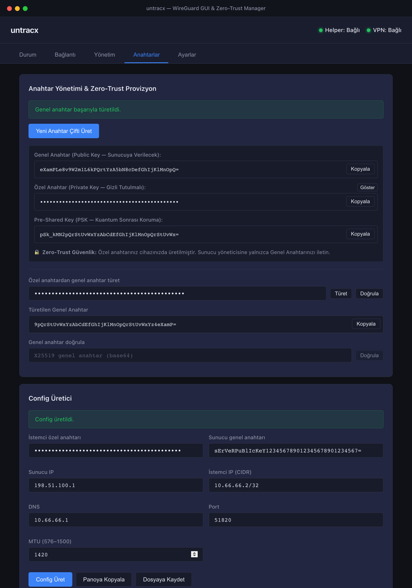

# untracx GUI

Tauri 2 + React TypeScript frontend for the untracx VPN.

## Kurulum

```bash
cd gui/frontend
npm install
npm run dev    # http://localhost:5173
npm run build  # prod build → dist/
```

## Tauri Build

```bash
# macOS
npm run tauri build

# Linux
npm run tauri build -- --target x86_64-unknown-linux-gnu

# Windows
npm run tauri build -- --target x86_64-pc-windows-msvc
```

## Ekran Görüntüleri

<p align="center">
  
</p>

## Tauri Komutları

| Komut | Parametre | Açıklama |
|---|---|---|
| `helper_start` | — | systemd user service olarak helper'ı başlatır |
| `helper_stop` | — | Helper servisini durdurur |
| `helper_status` | — | Helper durumu + socket varlık denetimi |
| `vpn_connect` | `configPath` | Config dosyasıyla VPN bağlantısı kurar |
| `vpn_down` | `iface` | Arayüz adıyla VPN bağlantısını keser |
| `vpn_status` | — | WireGuard bağlantı ve trafik durumunu sorgular |
| `peer_list` | `iface?` | Sunucudaki kayıtlı peer listesini getirir |
| `peer_add` | `name` | Yeni peer ekleme komut yönergesini hazırlar |
| `peer_remove` | `name` | Peer kaldırma komut yönergesini hazırlar |
| `keygen` | — | X25519 Curve25519 anahtar çifti ve PSK üretir |
| `public_from_private` | `privateKey` | Özel anahtardan genel anahtarı türetir |
| `validate_private_key` | `privateKey` | Base64 Curve25519 özel anahtar geçerliliğini doğrular |
| `validate_public_key` | `publicKey` | Base64 Curve25519 genel anahtar geçerliliğini doğrular |
| `generate_config` | `clientPrivate`, `serverPublic`, `serverIp`, `clientIp`, `dns`, `mtu`, `port`, `presharedKey?` | Standart WireGuard istemci konfigürasyonunu üretir |
| `save_config` | `content`, `path` | Konfigürasyonu `0600` izinleriyle atomik olarak diske yazar |

## Test ve Doğrulama

```bash
# Frontend testleri (Vitest)
npm --prefix gui/frontend run test

# Frontend lint ve kod stili kontrolü
npm --prefix gui/frontend run lint
npm --prefix gui/frontend run format:check

# Ekran görüntülerini otomatik yeniden üretme
node gui/frontend/capture-all.js
```

## Güvenlik

- GUI root/Admin olarak çalıştırılmaz.
- Helper yalnız önceden tanımlı profil ve ağ işlemlerini kabul eder.
- Özel anahtarlar bellekten anında `zeroize` edilir; istemci özel anahtarı sunucuya gönderilmez (Zero-Trust).
- Config dosyaları disk üzerinde `0600` izinleri ve atomik dosya işlemleri (`O_NOFOLLOW`) ile yazılır.
